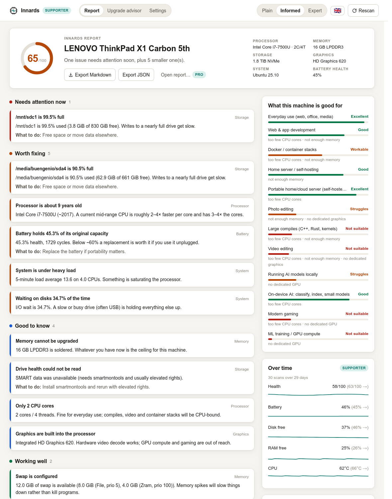

# Innards

**Look inside your machine.** Innards inspects the computer it runs on and explains what it found — in plain language, at the level of detail you choose, in your language — then tells you what the machine is still good for and what (if anything) is worth buying.

- One codebase, three desktop platforms: Linux, macOS, Windows (Tauri 2 + Rust + Svelte). Phones and SBCs via the `innards` CLI (aarch64 Linux, Android/Termux).
- Everything runs locally. No account, no telemetry, no network calls in the free tier.
- Three reading levels (plain / informed / expert), English and Spanish today, more via one JSON file.
- Findings are rules, not vibes: every line in the report has the raw evidence one click away.



## What it does

1. **Probes** CPU, memory, swap, drives (incl. SMART health), GPU, battery, thermal sensors, network, and load.
2. **Rules** turn the snapshot into findings with a severity: *needs attention now*, *worth fixing*, *good to know*, *working well*.
3. **Capability scores** answer "what is this machine still good for?" across twelve workloads, from everyday use to ML training — including "portable server" and "on-device AI" for phones and single-board computers (a rooted OnePlus 6T on postmarketOS is a first-class case).
4. **Upgrade advisor** (Supporter): five questions → ranked, costed recommendations, free software fixes first, honest about when the answer is "keep it" or "this chassis can't get there".
5. **Where to buy** (Pro): new / refurbished / used links per recommendation, by region.
6. **Narrated summary** (Supporter): the structured findings turned into a short narrative via the Claude API, using your own key.

## Quick start

```bash
# prerequisites: Rust (rustup), Node 22 + pnpm, and Tauri's platform deps
#   https://tauri.app/start/prerequisites/
pnpm install
pnpm tauri dev          # desktop app with hot reload
pnpm tauri build        # installers in target/release/bundle/ (workspace target dir)
```

Useful commands:

```bash
cargo run -p innards-core --example report -- en expert     # Markdown report in the terminal
cargo run -p innards-core --example report -- es plain
cargo run -p innards-core --example report -- --json        # full structured report
cargo run -p innards-core --example fixtures -- static/fixtures   # regenerate design-mode fixtures
cargo test -p innards-core                                  # incl. catalog completeness tests
cargo run -p innards-cli -- advise --uses portable_server,edge_ai --portable   # CLI: phones, SBCs, headless (see crates/innards-cli/README.md)
pnpm check                                                  # svelte-check
pnpm dev                                                    # UI only, in a browser, on fixture data
```

Design mode (browser, no Rust needed): `pnpm dev`, then open `http://localhost:1420/advisor?tier=pro&lang=es&demo=1&view=visual` (screens: `/`, `/advisor`, `/settings`; add `&snap=1` for deterministic screenshots). See [docs/DESIGN.md](docs/DESIGN.md).

## Repository map

```
crates/innards-core/    UI-agnostic engine: probes → snapshot → rules → findings → i18n render
  src/probe/            common (sysinfo/battery), linux, macos, windows, smart
  src/rules.rs          all findings and their thresholds
  src/capability.rs     workload scoring
  src/advisor.rs        questionnaire + recommendations + shop links
  i18n/{en,es}.json     every user-facing string, per level
  examples/             report (CLI), fixtures (design-mode data)
  src/soc.rs            SoC knowledge base (Snapdragon, Exynos, Tensor, Dimensity, Pi, Rockchip…) + mainline Linux status
  tests/catalogs.rs     every id used in code exists in every language
  tests/phone.rs        hand-built OnePlus 6T snapshots (postmarketOS / Android) through rules, scores, advisor
crates/innards-cli/     `innards` binary: report / advise / socs in a terminal; cross-compiles for phones (aarch64, Android)
src-tauri/              thin Tauri shell: commands, settings, license, Claude narration
src/                    Svelte 5 frontend (routes/, lib/components/, lib/state.svelte.ts)
static/fixtures/        generated JSON for browser design mode
tools/innards-license/  keygen + sign license keys (never shipped)
docs/                   ARCHITECTURE, IPC, AGENTS, DESIGN, MONETIZATION, press-kit/
```

## Pricing

| Tier | Price | Unlocks |
|---|---|---|
| Free | $0 | Full report, all levels, all languages, Markdown + JSON export |
| Supporter | $9 once (pay what you want from $5) | Upgrade advisor, narrated summaries, machine history (health/battery/disk over time) |
| Pro | $29 / year | Where-to-buy links (new / refurbished / used, by region); open and compare another machine's exported report |
| Team | $4 per machine / month (min 5) or $39 / machine / year | Fleet dashboard on Threadwise: health over time, upgrade budget, CSV export, scheduled auto-upload |
| Enterprise | from $2,500 / year | Self-hosted Threadwise, SSO/SAML, RBAC, audit log, data residency, custom rules, SLA |

Website: [innards.app](https://innards.app). Billing runs on Stripe via `billing/` (Cloudflare Pages Functions).

Licenses are offline Ed25519-signed keys; see [docs/MONETIZATION.md](docs/MONETIZATION.md).

## Documentation

- [docs/ARCHITECTURE.md](docs/ARCHITECTURE.md) — how the pieces fit, privacy model, how to add a rule / language / probe
- [docs/IPC.md](docs/IPC.md) — every Tauri command and its payload
- [docs/AGENTS.md](docs/AGENTS.md) — working agreement for AI agents and contributors
- [docs/DESIGN.md](docs/DESIGN.md) — brand, tokens, voice, and the brief for the website
- [docs/MONETIZATION.md](docs/MONETIZATION.md) — tiers, license keys, store plan
- [docs/press-kit/](docs/press-kit/) — boilerplate, facts, screenshots, pitch notes

## License

MIT. See [LICENSE](LICENSE).
